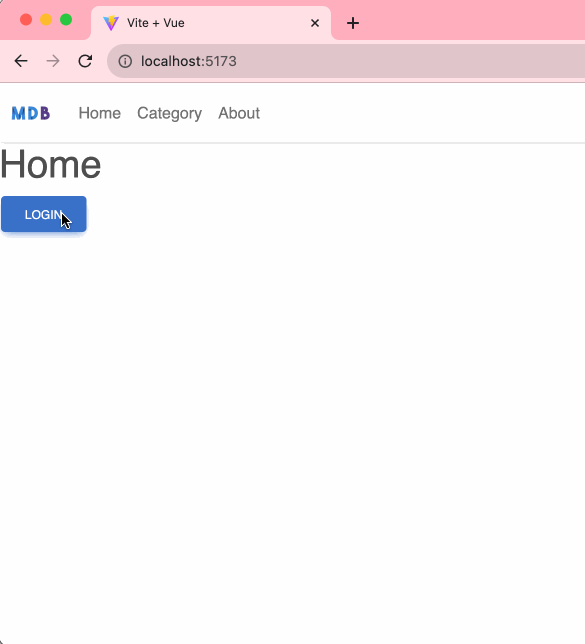

# vue-fintrack-1
 Vue implementation of Financial Tracker App

```bash
$ git clone https://github.com/cbatuic/vue-fintrack-1.git
$ cd vue-fintrack-1
$ npm install
$ npm run dev
```

### Code Snippets
```./src/router.js```

```js
import { createRouter, createWebHistory } from 'vue-router';
import Home from './components/Home.vue';
import Category from './components/Category.vue';
import About from './components/About.vue';
import Login from './components/Login.vue';

const routes = [
    { path: '/', component: Home },
    { path: '/category', component: Category },
    { path: '/about', component: About },
    { path: '/login', component: Login, name: Login },
];

const router = createRouter({
    history: createWebHistory(),
    routes,
});

export default router;
```

### Preview

